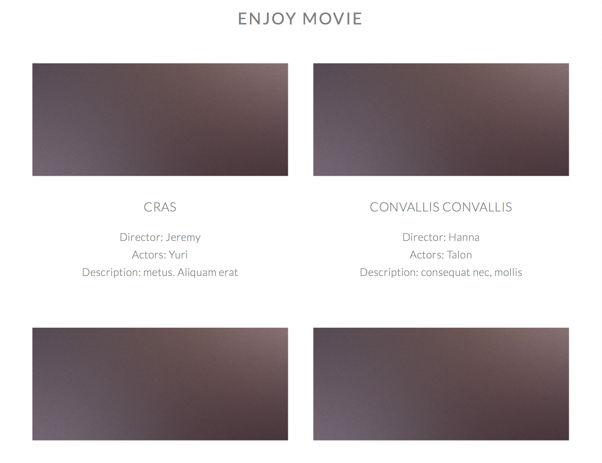
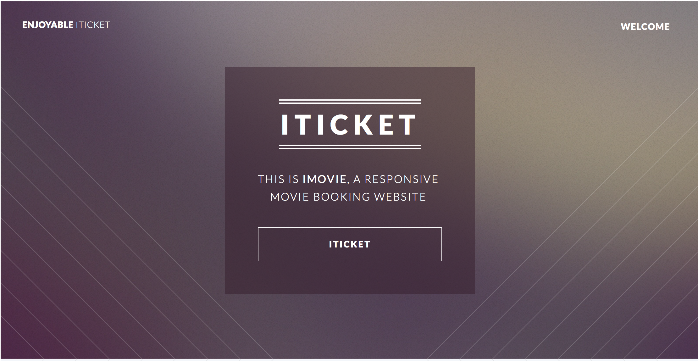
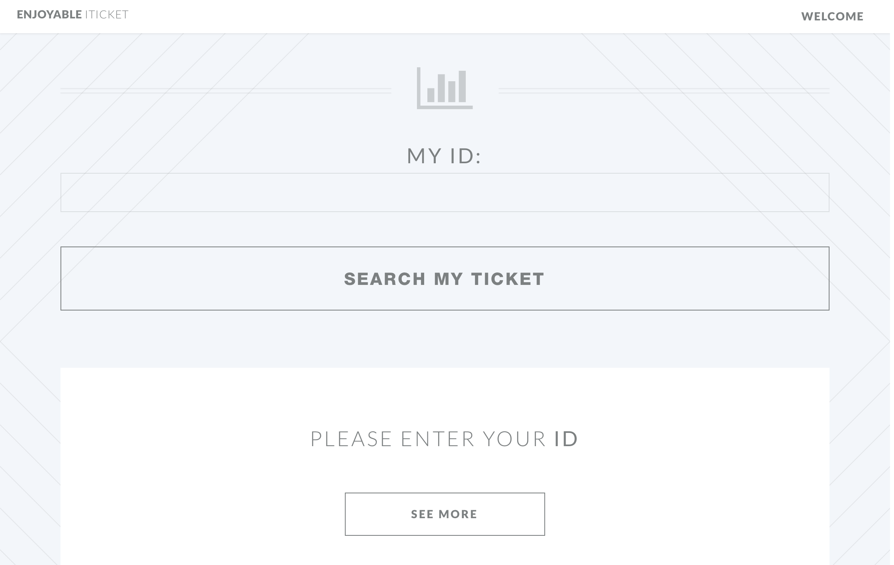
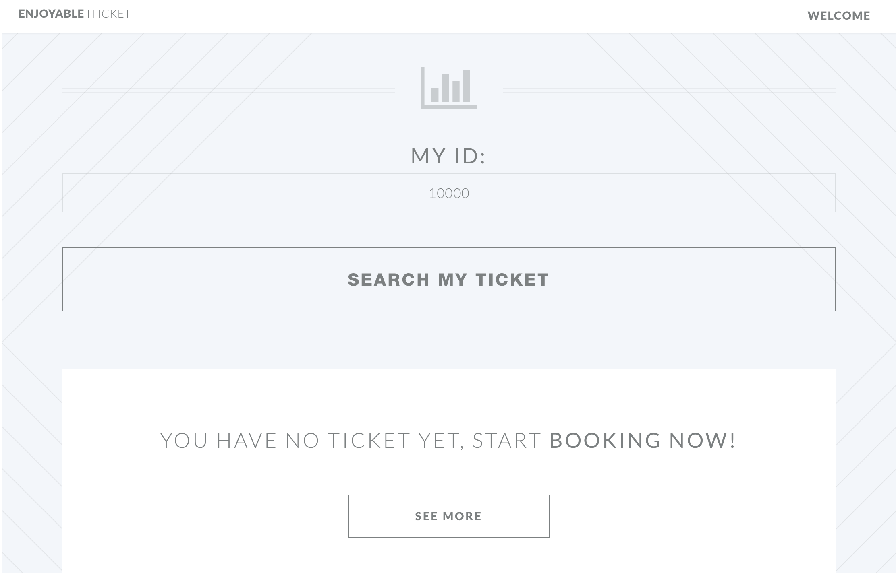
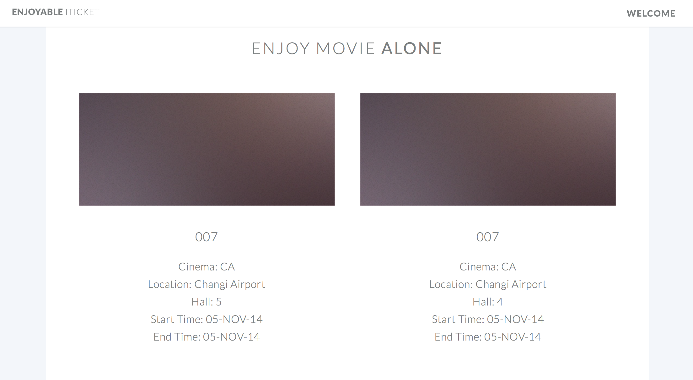
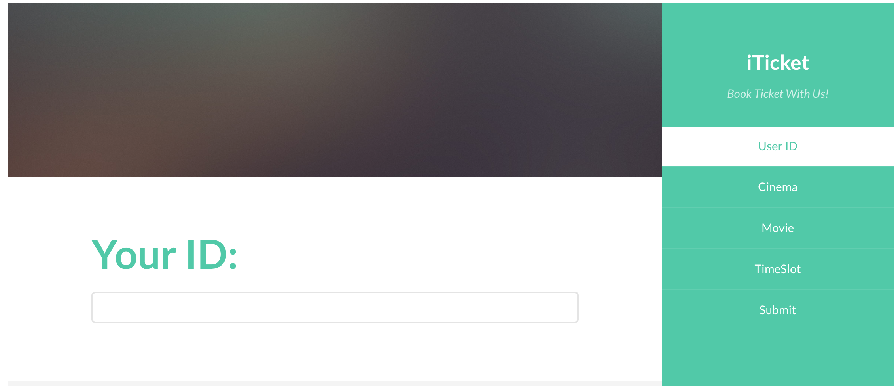
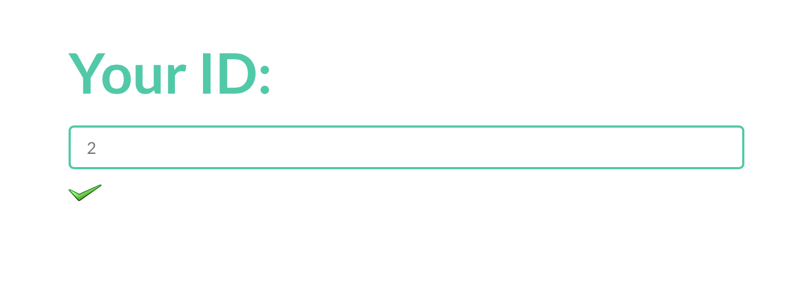
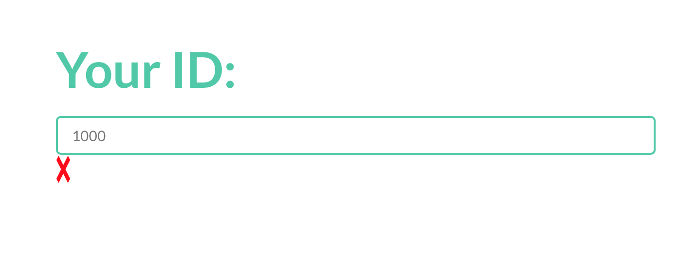
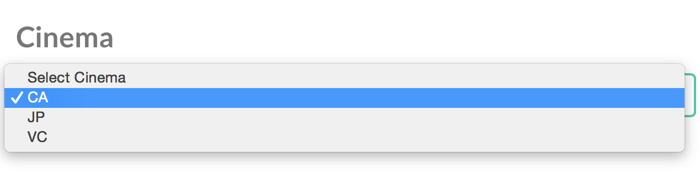
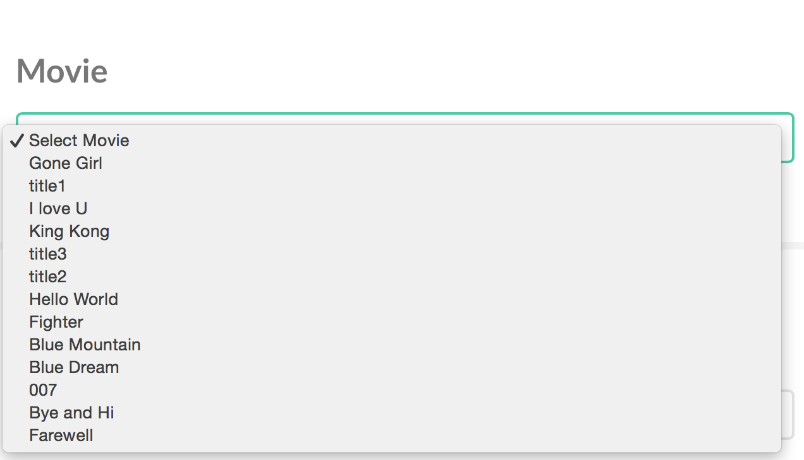

####Objectives
---
In this project, we aim to design a online movie tickets booking application to facilitate convenient searching and booking for users.
User will be allowed to search catalogue of movie based on the **movie title**,**movies attributes**(such as actors, director and movie descriptions),**time slots**,**cinema name**,**cinema location**, and **ticket price range**. In addition,after logging in, users are able to book movie tickets, and modify or cancel their booking afterwards. 
   

####Implementation
---
The structure of our web application can be categorised into two major part including front end components and back end components. 
The frond ends, basically user interface, is responsible for directly interacting with users including taking in issued commands and displaying feedback results.
The back ends, which is hidden from users' aspects, processes issued command passed by UI and returns feedback.

#####Component and Technologies Used
***
###### User Interface
In order to construct an effective user interface for our web applications, we have applied a right mix of a variety of technologies including HTML, CSS, Javascript and Ajax. We are aimed to implement a well-thought-out interaction design that reflects the perspective of our users and curtail to their needs.

###### Web Server
We use PHP as server page language,

###### Database 
Oracle SQL is used as database in our web application.

#####Database Schema

#####Functionalities & SQL implementation
***

#####Browsing

- **Browsing Cinema**

- **Display Movie list**

	Users are able to view all the movies by simply click the All Movie button in the navi bar, the page will display the whole list of movies:
	   
	
	  

		SELECT DISTINCT name FROM MOVIE;

#####Searching

---
- **Search for Movie**

	 To facilitate this search,we have implemented the SQL query code as follows:
 
		SELECT

- **Search for Booked Ticket**

	User can search for their booked ticket by simply enter their unique user ID.
	   
	
	  
	
	
	- When user click submit button with input field blank:
		 
	
	   
	
	  
	
	- When the issued User ID has no corresponding entry in ticket database situation, the page will prompt: 
		
	   
	
	  
		
	- For successful search, the result will be displayed as:
	   
	
	  

		
	 To facilitate this search,we have implemented the SQL query code as follows
		
		SELECT
		T.SUBSCRIBERID,S.USERNAME,
		O.MOVIETITLE,Cn.NAME,
		Cn.LOCATION,H.HALLID,
		T.STARTTIME,T.ENDTIME	
		FROM
		Ticket T, Occupy O, Subscriber S,
		Cinema Cn,Hall H
		WHERE 
		(T.STARTTIME = O.STARTTIME AND T.ENDTIME = 
		O.ENDTIME AND T.HALLID = O.HALLID)
		AND (H.NAMEOFCINEMA  = 
		Cn.NAME AND H.LOCATIONOFCINEMA = Cn.LOCATION)
		AND T.SUBSCRIBERID = S.SUBSCRIBERID
		AND S.SUBSCRIBERID = $USER_ID;

	
		

#####Booking

- **Book Ticket**

	User can book ticket with us
	
	   
	
	  
	
	_Use Case Flow:_
	
	- ID Check
	
	
	 
	
	
		
		
		SELECT COUNT(*) AS NUM FROM SUBSCRIBER WHERE SUBSCRIBERID =  "$cName";
		
	  

	- Fetch Cinema List
	

	
	 
	
		SELECT DISTINCT name FROM cinema;
	
	  

	- Fetch Movie List with specified cinema
		
	
	 
	
		SELECT 
		DISTINCT MOVIETITLE 
		FROM OCCUPY, HALL 
		WHERE OCCUPY.HALLID = HALL.HALLID
		AND HALL.NAMEOFCINEMA = "$cName";
		
	  
	- Fetch available timeslots 
	
		
		INSERT INTO TICKET(SUBSCRIBERID, STARTTIME, ENDTIME, HALLID)
		VALUES
		(“$userID”,
		TO_DATE("$sTime", 'HH24:Mi:SS dd/mm/yyyy’),
		TO_DATE(“$eTime", 'HH24:Mi:SS dd/mm/yyyy'),
		"$hallID");

	
	
	
   	

#####Screenshots
***

