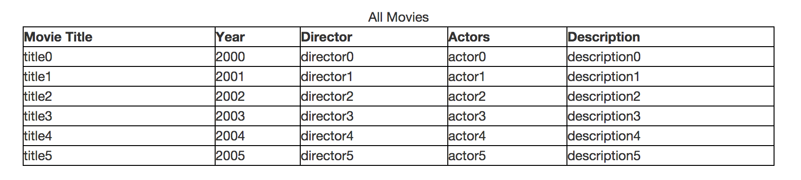
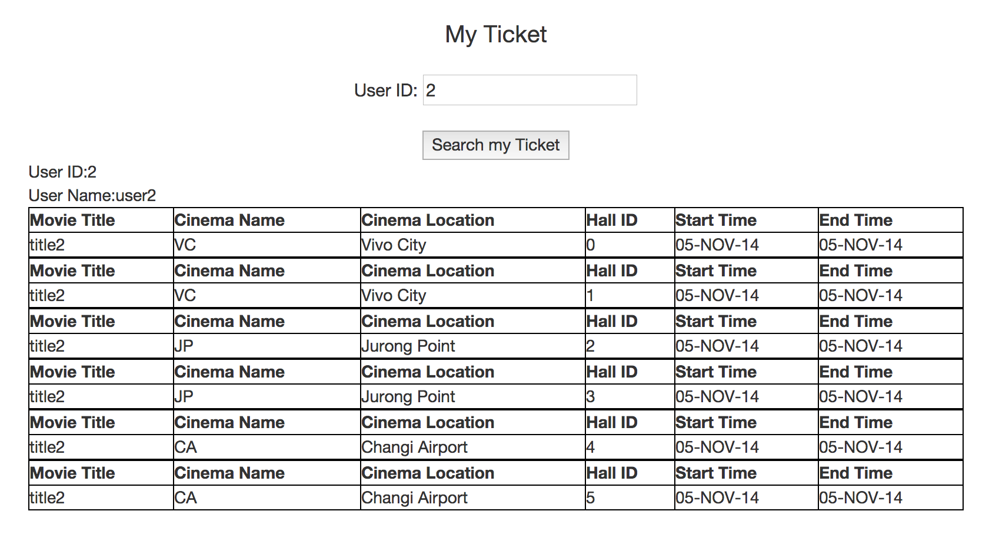

####Objectives
---
In this project, we aim to design a online movie tickets booking application to facilitate convienient searching and booking for users.
User will be allowed to search catalogue of movie based on the **movie title**,**movies attributes**(such as actors, director and movie descriptions),**time slots**,**cinema name**,**cinema location**, and **ticket price range**. In addition,after logging in, users are able to book movie tickets, and modify or cancel their booking afterwards. 
   

####Implementation
---
The strucure of our web application can be catergrized into two major part including front end components and back end components. 
The frond ends, basically user interface, is responsible for directly interacting with users including taking in issued commands and displaying feedback results.
The back ends, which is hidden from users' aspects, processes issued command passed by UI and returns feedback.

#####Component and Technologies Used
***
###### User Interface
In order to constrcut an effeictive uer interface for our web applications, we have applied a right mix of a variaty of technologies including HTML, CSS and Javascript. We are aimed to implement a well-thought-out interaction design that reflects the perspective of our users and curtail to their needs.

###### Web Server

###### Server page language

###### Database 

#####Database Schema

#####Functionalites & SQL implementation
***

#####Browsing

- **Display Movie list**
	Users are able to view all the movies by simply click the All Movie button in the navi bar, the page will display the whole list of movies:
	   
	
	  
	
- **Display Cinema list**

		SELECT DISTINCT name FROM cinema

#####Searching

- **Search for Movie**

---

- **Search for Cinema**

---
- **Search for Booked Ticket**

	User can search for their booked ticket by simply enter their unique user ID.
	
	Use cases:
	- Input User ID is empty:
	
		For this situation, the page will prompt: 
	
	   
	
	  
	
	- Input User ID has no correspondint entry in ticket database :
	
		For this situation, the page will prompt: 
	   
	
	  
		
		For successful search, the result will be displayed as:
	   
	
	  

	To facilitate this search,we have implemented the SQL query code as follows:
		
		
		
		SELECT
		T.SUBSCRIBERID,S.USERNAME,
		O.MOVIETITLE,Cn.NAME,
		Cn.LOCATION,H.HALLID,
		T.STARTTIME,T.ENDTIME	
		FROM
		Ticket T, Occupy O, Subscriber S,
		Cinema Cn,Hall H
		WHERE 
		(T.STARTTIME = O.STARTTIME AND T.ENDTIME = 
		O.ENDTIME AND T.HALLID = O.HALLID)
		AND (H.NAMEOFCINEMA  = 
		Cn.NAME AND H.LOCATIONOFCINEMA = Cn.LOCATION)
		AND T.SUBSCRIBERID = S.SUBSCRIBERID
		AND S.SUBSCRIBERID = $USER_ID;

	
		

#####Booking

- **Book Ticket**

#####Screenshots
***

