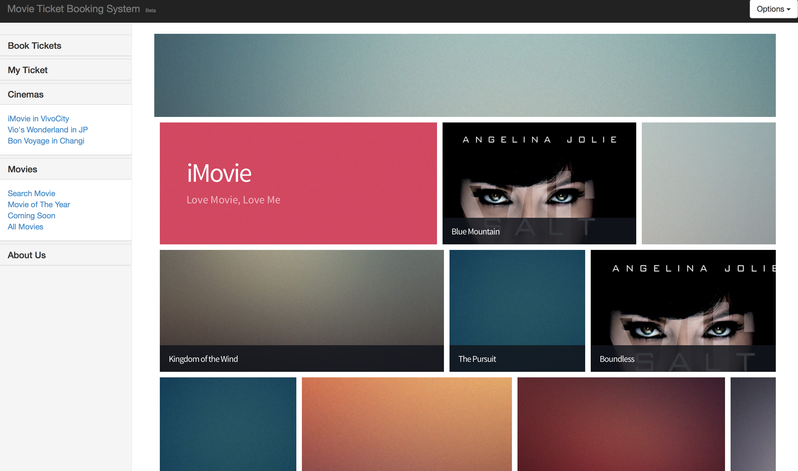
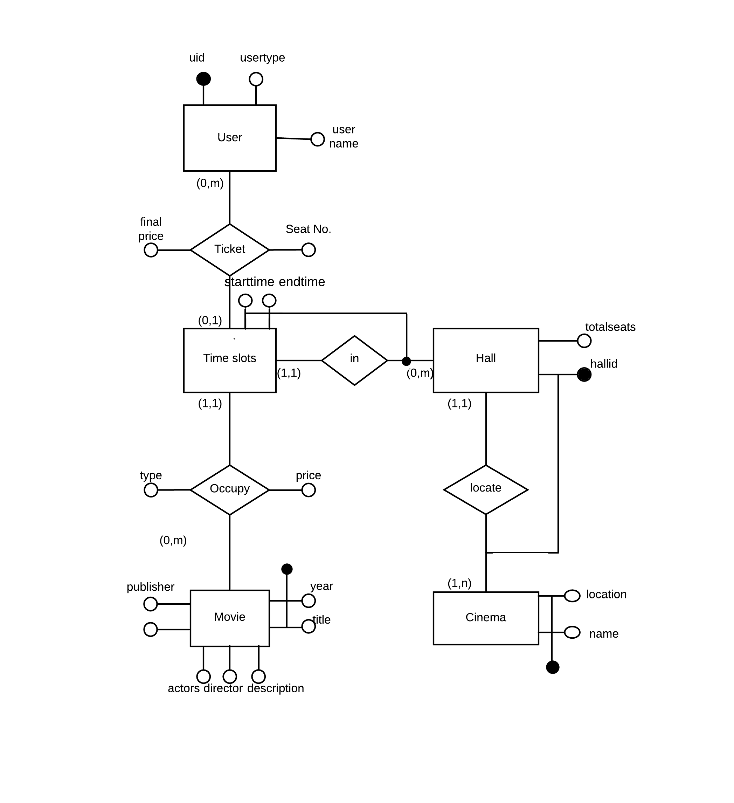
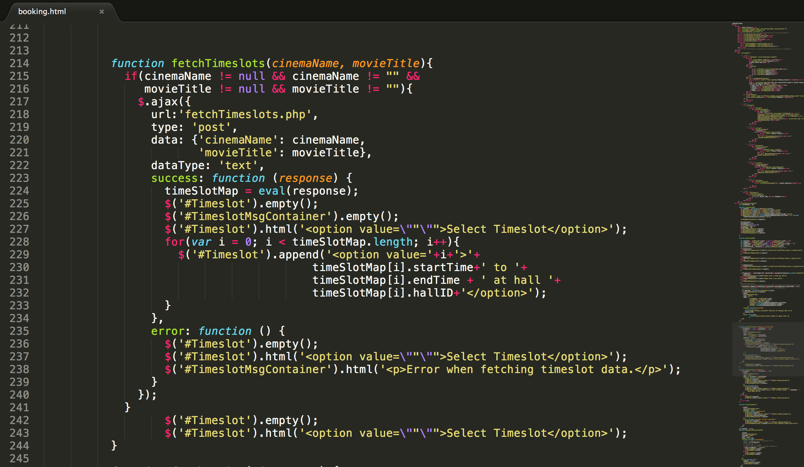
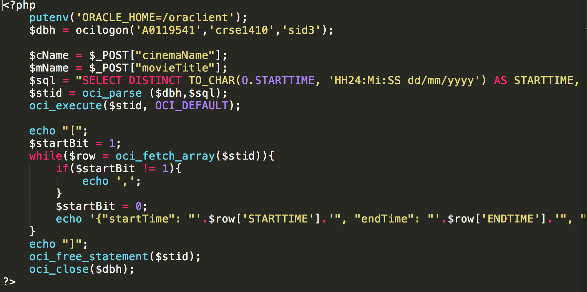

    
#
 CS2102 Final Report Online Booking System

###
Movie Tickets Booking System
 
          
###
Hu Wenyan (A0119397R)
###
Lu Yuehan (A0119387U)
###
Luan Wenhao (A0119541J)

              

 07 November 2014

####Objectives
---
In this project, we aim to design a online movie tickets booking application to facilitate convenient searching and booking for users.
User will be allowed to search catalogue of movie based on the **movie title**,**movies attributes**(such as actors, director and movie descriptions),**time slots**,**cinema name**,**cinema location**, and **ticket price range**. In addition,after logging in, users are able to book movie tickets, and modify or cancel their booking afterwards. 
   

####Implementation
---
The structure of our web application can be categorised into two major part including front end components and back end components. 
The frond end, basically user interface, is responsible for directly interacting with users including taking in issued commands and displaying feedback results.
The back end, which is hidden from users' aspects, processes issued command passed by UI and returns feedback.

#####Components
***
###### User Interface
In order to construct an effective user interface for our web applications, we have applied a right mix of a variety of web development languages, tools and platforms including *HTML*, *CSS*, *Javascript* and *AJAX*. We aim to implement a well-thought-out interaction design that reflects the perspective of our users and curtail to their needs.
	 
	
	 

###### Web Server
We use the SoC sub-zone to host our website. The interaction medium between the user interface and the server with our database is PHP language which will query or manipulate the database according to input from the user interface using `POST` method. With the information from users and the database, our PHP scripts will generate HTML codes that will later serve as part of the user interface.

###### Database 
We stay with Oracle SQL which is discussed in the module lectures. We try to apply the knowledge we learnt from the course to this website project and it is also good for us to reflect on what we have learnt with this hands-on practice.

######Database Schema
We designed the database schema following our ER Diagram which has been discussed in our progress report.

#####Functionalities & SQL implementation
***

#####Browsing

- **Browsing Cinema**

	Users are able to view all the cinemas and the movies showing in the selected cinemas by simply click on any of the three cinema links in the navigation bar, the page will display information about the cinema and its movies:
	 
	
	 

		SELECT * FROM CINEMA;

- **Display Movie list**

	Users are able to view all the movies by simply click the All Movie button in the navigation bar, the page will display the whole list of movies:
	 
	
	 

		SELECT DISTINCT TITLE FROM MOVIE;

#####Searching

- **Search for Movie**

	 To facilitate this search,we have implemented the SQL query code as follows:
 
		SELECT * FROM MOVIE WHERE TITLE LIKE '%"$Key"%';

- **Search for Booked Ticket**

	User can search for their booked ticket by simply enter their unique user ID.
	   
	
	  
	
	
	- When user click submit button with input field blank:
		 
	   
	
	  
	
	- When the issued User ID has no corresponding entry in ticket database situation, the page will prompt: 
		
	 
	
	  
		
	- For successful search, the result will be displayed as:
	   
	
	  

		
	 To facilitate this search,we have implemented the SQL query code as follows
		
		SELECT
		T.SUBSCRIBERID,S.USERNAME,
		O.MOVIETITLE,Cn.NAME,
		Cn.LOCATION,H.HALLID,
		T.STARTTIME,T.ENDTIME	
		FROM
		Ticket T, Occupy O, Subscriber S,
		Cinema Cn,Hall H
		WHERE 
		(T.STARTTIME = O.STARTTIME AND T.ENDTIME = 
		O.ENDTIME AND T.HALLID = O.HALLID)
		AND (H.NAMEOFCINEMA  = 
		Cn.NAME AND H.LOCATIONOFCINEMA = Cn.LOCATION)
		AND T.SUBSCRIBERID = S.SUBSCRIBERID
		AND S.SUBSCRIBERID = $USER_ID;

	
		

#####Booking

- **Book Ticket**

	User can book ticket with us
	
	   
	
	  
	
	_Use Case Flow:_
	
	- ID Check
		- Note that the User ID validation check is performed immediately when user finishes typing (input field loses focus). It is done by querying the database with the user ID input.
	
	
	 
	
	
		
		
		SELECT COUNT(*) AS NUM FROM SUBSCRIBER WHERE SUBSCRIBERID =  "$cName";
		
	  

	- Fetch Cinema List
	

	
	 
	
		SELECT DISTINCT name FROM cinema;
	
	  

	- Fetch Movie List with specified cinema
		- Note that whenever the selection in the "Select Cinema" option menu is changed, the Movie List options will change accordingly and immediately by performing an SQL query with AJAX.
		
	
	 
	
		SELECT 
		DISTINCT MOVIETITLE 
		FROM OCCUPY, HALL 
		WHERE OCCUPY.HALLID = HALL.HALLID
		AND HALL.NAMEOFCINEMA = "$cName";
		
	  
	- Fetch available timeslots 
		- Note that whenever the selection in the "Select Movie" option menu is changed, the Timeslot List options will change accordingly and immediately by performing an SQL query with AJAX.
		
	 
	
	 
		
		INSERT INTO TICKET(SUBSCRIBERID, STARTTIME, ENDTIME, HALLID)
		VALUES
		(“$userID”,
		TO_DATE("$sTime", 'HH24:Mi:SS dd/mm/yyyy’),
		TO_DATE(“$eTime", 'HH24:Mi:SS dd/mm/yyyy'),
		"$hallID");

	
	
	
   	

#####Technical Specifications
***
#####JavaScript

- With library **jQuery**.
- With data format support **JSON**.
- With client-server communication technique **AJAX**.
- Sample code:
	- Using **jQuery** with **AJAX** to fetch timeslots of movies.
		
	

#####PHP

- With library **OCI8**
- Sample code:
	- Using **PHP** to query database and echo **JSON** to **AJAX**
	
		 